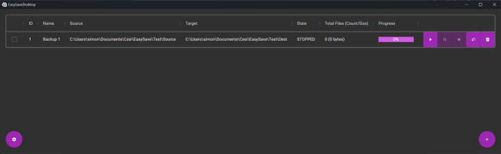
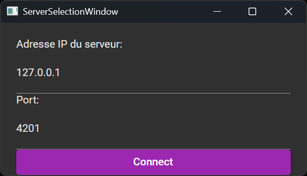

# EasySave - User Manual

## Introduction
EasySave is a software designed to facilitate file and directory backups. This guide provides instructions for using both the console and graphical versions of the application.

---

## Installation and Launch

### Installation:
1. Run the **EasySave.msi** file and follow the instructions to install the application.

### Console Version:
1. Open a terminal (PowerShell, CMD, or another).
2. The console version of EasySave is added to the **Windows PATH**, so you can execute it from any directory.
3. Type `easysave help` to display the list of available commands.

### Graphical Version:
1. Simply launch **EasySave Desktop** from the Start menu or File Explorer.

---

## Using the Console Version

### Available Commands:

| Command                                                             | Description                                 |
| ------------------------------------------------------------------- | ------------------------------------------- |
| `easysave create <name> <sourceDirectory> <targetDirectory> <type>` | Creates a new backup configuration.         |
| `easysave remove <id>`                                              | Deletes a backup configuration by its ID.   |
| `easysave <id1;id2;id3>`                                            | Executes multiple specific backups.         |
| `easysave <id1-id3>`                                                | Executes a sequence of consecutive backups. |
| `easysave help`                                                     | Displays the help message.                  |

---

## Explanation of Parameters:
- `<name>` : Name of the backup job (e.g., `daily_backup`).
- `<sourceDirectory>` : Path of the source directory (e.g., `C:\Users\Images`).
- `<targetDirectory>` : Path of the destination directory (e.g., `D:\Backup\Images`).
- `<type>` : Backup type (`Full` for complete backup, `Differential` for incremental backup).
- `<id>` : Identifier of the backup job to execute.
- `<id1;id2;id3>` : List of backup job IDs to run sequentially (non-consecutive).
- `<id1-id3>` : Range of backup job IDs to execute consecutively.

---

## Example Commands:
- Create a full backup job:
  ```
  easysave create backupExample C:\Users\Example D:\Backup\Example Full
  ```
- Execute a specific backup job:
  ```
  easysave 1
  ```
- Execute multiple non-sequential backup jobs:
  ```
  easysave 1;3;5
  ```
- Execute multiple consecutive backup jobs:
  ```
  easysave 2-4
  ```

---

## Backup Server Configuration
If the backup server is hosted on the same PC, keep the default IP address **127.0.0.1**.
Otherwise, specify the IP address of the remote server and the corresponding port (**4201** by default).
 
---

## Credits
**Developed by: Tom Raineri , Simon LEDOUX , Lucas Guichemerre**  
**Group 3 - ProSoft**

---

This manual provides basic instructions for using EasySave. For more details, please refer to the complete documentation.

