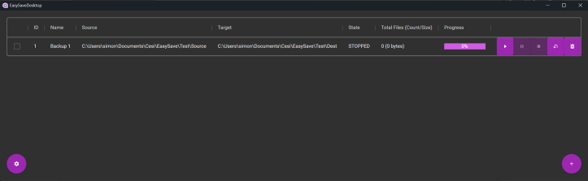
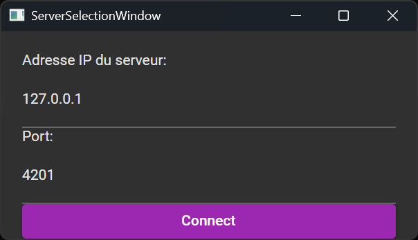

# EasySave - Manuel Utilisateur

## Introduction
EasySave est un logiciel conçu pour faciliter la sauvegarde de fichiers et de répertoires. Ce guide fournit des instructions pour l'utilisation des versions console et graphique de l'application.

---

## Installation et Lancement

### Installation :
1. Exécutez le fichier **EasySave.msi** et suivez les instructions pour installer l'application.

### Version Console :
1. Ouvrez un terminal (PowerShell, CMD ou autre).
2. La version console d'EasySave est ajoutée au **PATH** de Windows, vous pouvez donc l'exécuter depuis n'importe quel dossier.
3. Saisissez `easysave help` pour afficher la liste des commandes disponibles.

### Version Graphique :
1. Lancez simplement **EasySave Desktop** depuis le menu Démarrer ou l'Explorateur de fichiers.

---

## Utilisation de la Version Console

### Commandes Disponibles :

| Commande                                                           | Description                                          |
| ------------------------------------------------------------------ | ---------------------------------------------------- |
| `easysave create <nom> <sourceDirectory> <targetDirectory> <type>` | Crée une nouvelle configuration de sauvegarde.       |
| `easysave remove <id>`                                             | Supprime une configuration de sauvegarde par son ID. |
| `easysave <id1;id2;id3>`                                           | Exécute plusieurs sauvegardes spécifiques.           |
| `easysave <id1-id3>`                                               | Exécute une séquence de sauvegardes consécutives.    |
| `easysave help`                                                    | Affiche le message d'aide.                           |

---

## Explication des Paramètres :
- `<nom>` : Nom de la sauvegarde (ex. `sauvegarde_quotidienne`).
- `<sourceDirectory>` : Chemin du répertoire source (ex. `C:\Users\Images`).
- `<targetDirectory>` : Chemin du répertoire de destination (ex. `D:\Backup\Images`).
- `<type>` : Type de sauvegarde (`Full` pour une sauvegarde complète, `Differential` pour une sauvegarde incrémentale).
- `<id>` : Identifiant d'une sauvegarde à exécuter.
- `<id1;id2;id3>` : Liste d'IDs de sauvegardes à exécuter séquentiellement (non consécutifs).
- `<id1-id3>` : Plage d'IDs de sauvegardes à exécuter consécutivement.

---

## Exemples de Commandes :
- Créer une sauvegarde complète :
  ```
  easysave create backupExample C:\Users\Example D:\Backup\Example Full
  ```
- Exécuter une sauvegarde spécifique :
  ```
  easysave 1
  ```
- Exécuter plusieurs sauvegardes non consécutives :
  ```
  easysave 1;3;5
  ```
- Exécuter plusieurs sauvegardes consécutives :
  ```
  easysave 2-4
  ```

---

## Configuration du Serveur de Backup
Si le serveur de backup est hébergé sur le même PC, laissez l'adresse IP par défaut **127.0.0.1**.
Sinon, indiquez l'adresse IP du serveur distant ainsi que le port correspondant (**4201** par défaut).
    
---

## Crédits
**Développé par : Tom RAINERI, Simon LEDOUX, Lucas GUICHEMERRE**  
**Groupe 3 - ProSoft**

---

Ce manuel fournit les instructions de base pour utiliser EasySave. Pour plus de détails, référez-vous à la documentation complète.

